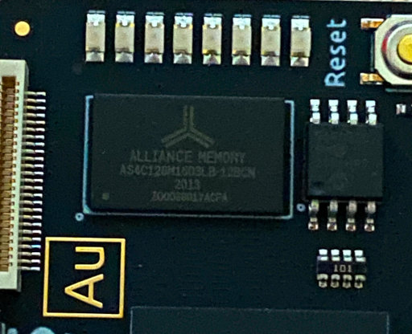
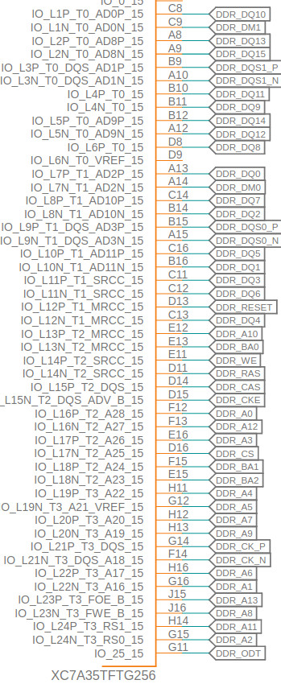
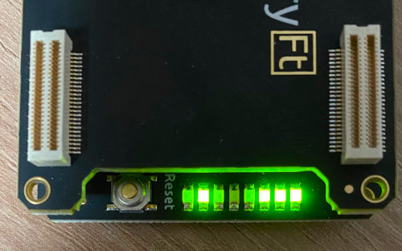

# BasicDDR

Intro project to DDR interface setting.

## Target
### Software

* Xilinx Vivado 2023.1

### Hardware

* Alchitry Au Board : Xilinx Artix 7 FPGA

## Parts

* FPGA: xc7a35tftg256-1
* RAM: AS4C128M16D3LB-12BCN

## Spec

* RAM (AS4C128M16D3LB-12BCN)
  - In datasheet and AU board schematic
    + DDR3L-1600 CL11 in datasheet: 1.25 ns cycle time (800 MHz)
    + Connected to 1.35V in schematic

* FPGA (xc7a35tftg256-1)
  - For speed grade -1 in DS181
    + DDR3L 4:1 Memory Controller: max 667 Mbps
    + DDR3L 2:1 Memory Controller: max 620 Mbps

## Create Vivado Project and Build

1. Create new RTL project in Vivado.

You need to select part `xc7a35tftg256-1`.

2. Add Memory Interface Generator IP

You need to select clock combination. 3077 / 5000 is recommended for simplify.

You need to supply sys_clk, clk_ref using additional MMCM and you can skip clk_ref if you use system clock as reference clock, especially for 200 MHz case.

For 4:1 ratio, you need to adjust below 667 Mbps by FPGA spec. `1 / (666.66666 * 10**6 / 2) * 10**12 = 3000.0 ps`. Min 3000.0 ps (333.333 MHz)

For 2:1 ratio, you need to adjust below 620 Mbps by FPGA spec. `1 / (620 * 10**6 / 2) * 10**12 = 3225.8 ps`. Min 3225.8 ps (310.0 MHz)

| Clock Period | PHY to Contoller Clock Ratio | Input Clock Period | Additional MMCM output | Synth | Operation | Note |
| --- | --- | --- | --- | --- | --- | --- |
| 3000 ps (333.333 MHz) | 4:1 | 6000 ps (166.6667 MHz) | 166.66667 MHz / 200 MHz | OK | OK | |
| 3000 ps (333.333 MHz) | 4:1 | 9000 ps (111.1111 MHz) | 111.11111 MHz / 200 MHz | OK | OK | |
| 3226 ps (309.981 MHz) | 2:1 | 6452 ps (154.991 MHz) | 155.00000 MHz / 201.5 MHz | OK | OK | Different APP_DATA_WIDTH, MASK_WIDTH |
| 3077 ps (324.992 MHz) | 4:1 | 6154 ps (162.496 MHz) | 162.50000 MHz / 198.04688 MHz | OK | OK | |
| 3077 ps (324.992 MHz) | 4:1 | 5000 ps (200.000 MHz) | 200 MHz | OK | OK | Use system clock as reference clock |

Select `IP Catalog` under project, search and open `Memory Interface Generator`.

Follow next setting steps.

* Initial
  - Create Design
  - Component Name: **mig_7series_0**
  - Number of controllers: 1
  - AXI4 Interface: none

* Pin Compatible FPGAS
  - xc7a35ti-ftg256

* Memory Selection
  - DDR3 SDRAM

* Controller Options
  - Clock Period: 3077 ps
    - See above clock combinations.
  - PHY to Controller Clock Ratio: 4:1
  - Memory Type: Components
  - Select `Create Custom Part`
    - Select base part: MT41K128M16XX-15E
    - Enter new memory part name: AS4C128M16D3LB-12BCN
    - tcke: 5 ns
    - tfaw: **40 ns**
    - tras: 35 ns
    - trcd: 13.75 ns
    - trefi: 7.8 us
    - trfc: **160 ns**
    - trp: 13.75 ns
    - trrd: 6 ns
    - trtp: 7.5 ns
    - twtr: 7.5 ns
    - Row address: 14
    - Column address: 10
    - Bank address: 3
  - Memory Voltage: **1.35V**
  - Data Width: **16**
  - ECC: Disabled
  - Data Mask: on
  - Number of Bank Machines: 4
  - Ordering: **Normal**

You can find timing parameters in RAM datasheet.

* Memory Options
  - Input Clock Period: 5000 ps (200 MHz)
  - Read Burst Type and Length: Sequential
  - Output Driver Impedance Control: RZQ/7
  - RTT: RZQ/4
  - Controller Chip Select Pin: Enable
  - Memory Address Mapping Selection: Bank/Row/Column

* FPGA Options
  - System Clock: No Buffer
  - Reference Clock: Use System Clock
    - Only avaiable if input clock period is 200 MHz.
    - If you selected another clock combination, select `No Buffer`
  - System Reset Polarity: **ACTIVE HIGH**
  - Debug Signals for Memory Controller: OFF
  - Sample Data Depth: 1024
  - Internal Vref: **ON**
  - IO Power Reduction: ON
  - XADC Instantiation: Enabled

* EXtended FPGA Options
  - Internal Termination Impedance: 50 Ohms

* IO Planning Options
  - Fixed Pin Out

* Pin Selection
  - Select `Read XDC/UCF` and load `constraint/ddr.ucf`
    - Or you can select manually by below schematic.
    - If you want to select pin manually, check pins on both FPGA, RAM side. There are some naming issues. For example, DDR_CS in schematic is directly connected to RAM CS' pin.
  - Select `Validate`

* System Signals Selection
  - sys_rst: No connect
  - init_calib_complete: No connect
  - tg_compare_error: No connect

* Review Summary

3. Add Clock Wizard IP

Select `IP Catalog` under project, search and open `Clock Wizard`.

* Component Name: **clk_wiz**

* Clocking Options
  - Enable Clock Monitoring: OFF
  - Primitive: MMCM
  - Frequency Synthesis: ON
  - Phase Alignment: OFF
  - Dynamic Reconfig: OFF
  - Safe Clock Startup: OFF
  - Minimize Power: OFF
  - Spread Spectrum: OFF
  - Dynamic Phase Shift: OFF
  - Jitter Optimization: Balanced
  - Input Primary
    - Port Name: **clk_in**
    - Input Frequency: 100.0 MHz
    - Jitter Options: UI
    - Input Jitter: 0.010
    - Source: **No buffer**

* Output Clocks
  - clk_out1
    - Port Name: **clk_out_200**
    - Requested: 200.000
    - Phase: 0.000
    - Duty Cycle: 50.000
    - Drives: BUFG
  - Source: Automatic Control On-Chip
  - Enable Optional Inputs
    - reset: ON
    - locked: ON
    - power_down: OFF
    - clkfbstopped: OFF
    - input_clk_stopped: OFF
  - Reset Type: Active High

If you selected another clock combination, you need an another clock output.

You need fixed 200 Mhz for clk_ref_i and selected input clock period for sys_clk_i.

For example, if you selected 6000 ps (166.6667 MHz) as input clock period, you need 166.6667 MHz output for sys_clk_i and 200 MHz output for clk_ref_i.

* Review Summary

4. Add constraint file to project.

Add alchitry.xdc in constraint directory to project.

5. Add source files to project.

Add hdl directory to project.

If you selected another clock combination, you need to input clk_ref_i.

Also check you ADDR_WIDTH, APP_DATA_WIDTH in ddr_test.sv

5. Set `bin_file` option to implementation.

You need generate bin file to upload.

Right click on `Implementation` and enable `bin_file` in `write_bitstream` section.

6. Generate Bitstream

## Upload

Same as [FtBasicWrite](../FtBasicWrite/README.md)

## Test

You should see 4 LEDs if DDR unit is fully initialized (test_ok, locked, init_calib_complete, 1).

