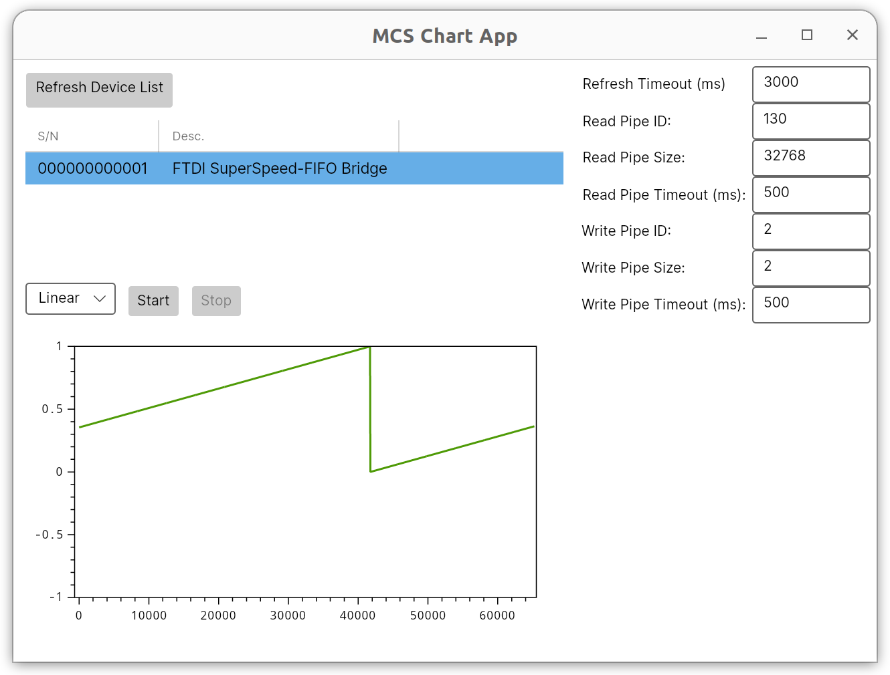

# FtClientDotNet

FT600 (FTD3xx) Read/Write Client Example Program (.NET)

## Target

* .NET 6

## Build

```
dotnet build -c Release
```

## Read Test

The 'TestRead' program receives data from the FT600. To receive from FT600, run the 'TestRead' program. You will need to copy the dynamic library (.so or .dll) into build directory.

```
sudo dotnet run --project TestRead -c Release
```

You can check the RX transfer rate if it works properly as follows (on ThinkPad T540p, Ubuntu 22.04):

```
Number of devices: 1
Flags: 4, Type: 258, ID: 403601E, SerialNumber: 000000000001, Description: FTDI SuperSpeed-FIFO Bridge
177.57 (MB/s) - 177569792 bytes in 1000025.10 (us)
177.60 (MB/s) - 177602560 bytes in 1000010.60 (us)
175.10 (MB/s) - 175112192 bytes in 1000084.80 (us)
```

## Write Test

The 'TestWrite' program sends data to the FT600. To send to FT600, run the 'TestWrite' program. You will need to copy the dynamic library (.so or .dll) into build directory.

```
sudo dotnet run --project TestWrite -c Release
```

You can check the TX transfer rate if it works properly as follows (on ThinkPad T540p, Ubuntu 22.04):

```
Number of devices: 1
Flags: 4, Type: 258, ID: 403601E, SerialNumber: 000000000001, Description: FTDI SuperSpeed-FIFO Bridge
186.32 (MB/s) - 186351616 bytes in 1000152.10 (us)
181.88 (MB/s) - 181895168 bytes in 1000104.30 (us)
186.08 (MB/s) - 186089472 bytes in 1000026.20 (us)
```

## MCS Chart App

The 'McsChartApp' program sends command to the FT600 and receives data from the FT600. This program works with [FtMcs](../FtMcs/README.md) You will need to copy the dynamic library (.so or .dll) into build directory.

```
sudo dotnet run --project McsChartApp -c Release
```

Press 'Refresh Device List' and select target device. Then press 'Start' button to start operation. You can check data on chart area:


